# Gettings started with Marvin on TTN

To get started the following steps are required:

- Install development environment
- Install boards
- Install libraries
- Select the board
- Get board information
- Register with TTN
- Create sketch
- Download sketch

## Install development environment

Go to [the Arduino software page](http://www.arduino.cc/en/software), scroll down to 'Legacy IDE' and download the correct version for your OS. After downloading, install the software.

## Install boards

The Arduino IDE should come with the Arduino boards pre-loaded. Because the Marvin is based on the Arduino Leonardo no additional software is required.

## Install libraries

The Things Industries provides libraries for use with their hardware. Because TTI uses the same LoRaWAN hardware their library can be used to the Marvin as well.

In the Arduino IDEs 'Sketch' menu open item 'Include Librarties' and select 'Manage Libraries'

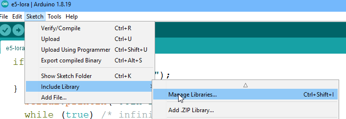

Search for 'TheThings' and install 'TheThingsNetwork'

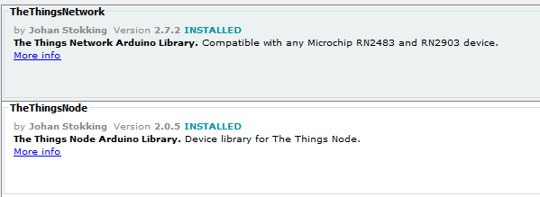

## Select the board

Insert the Marvin into an USB port of your computer. In the 'Tools' menu of the Arduino IDE select 'Board', from the sub menus select 'AVR Boards' and 'Arduino Leonardo'.

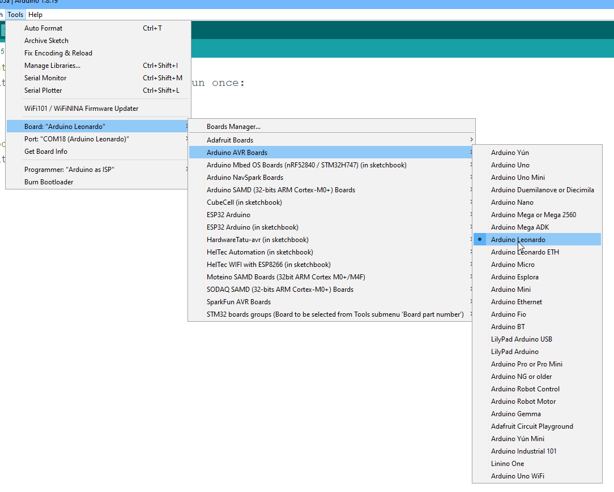

Now select the port, in the 'Tools' menu select 'Port' and choose the right one from the options available.

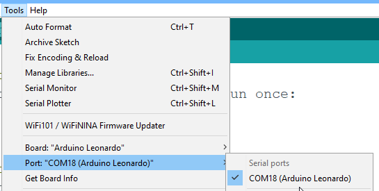

## Get board information

From the 'File' menu, open 'Examples', scroll to the 'TheThingsNetwork' and select 'DeviceIno'

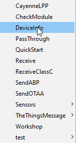

Modify the sketch by replacing the string 'REPLACE_ME' with 'TTN_FP_EU868' and add the following lines before 'setup':

```
int     reset_port = 5;
int     RN2483_power_port = 6; //Note that an earlier version of the Marvin doesn't support seperate power to RN2483
```

In 'setup' add:

```
  //Enable power to the RN2483
  pinMode(RN2483_power_port, OUTPUT);
  digitalWrite(RN2483_power_port, HIGH);
  debugSerial.println("RN2483 Powered up");
  delay(1000);
  
  //Disable reset pin
  pinMode(reset_port, OUTPUT);
  digitalWrite(reset_port, HIGH);
```

The result should look like:

```
#include <TheThingsNetwork.h>

#define loraSerial Serial1
#define debugSerial Serial

// Replace REPLACE_ME with TTN_FP_EU868 or TTN_FP_US915
#define freqPlan TTN_FP_EU868

TheThingsNetwork ttn(loraSerial, debugSerial, freqPlan);

int     reset_port = 5;
int     RN2483_power_port = 6; //Note that an earlier version of the Marvin doesn't support seperate power to RN2483

void setup()
{
  loraSerial.begin(57600);
  debugSerial.begin(9600);

  //Enable power to the RN2483
  pinMode(RN2483_power_port, OUTPUT);
  digitalWrite(RN2483_power_port, HIGH);
  debugSerial.println("RN2483 Powered up");
  delay(1000);
  
  //Disable reset pin
  pinMode(reset_port, OUTPUT);
  digitalWrite(reset_port, HIGH);
}

void loop()
{
  debugSerial.println("Device Information");
  debugSerial.println();
  ttn.showStatus();
  debugSerial.println();
  debugSerial.println("Use the EUI to register the device for OTAA");
  debugSerial.println("-------------------------------------------");
  debugSerial.println();

  delay(10000);
}
```

Use the Arrow pointing to the right just below the menu to compile and download the code.

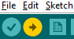

Next open the 'Serial Monitor' from the 'Tools' menu and watch the output. 
Make a note of the HEX values of the AppEUI and EUI.

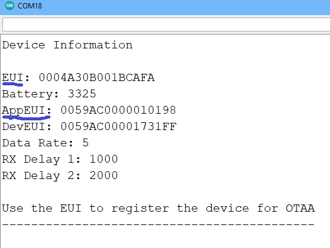

## Register with TTN

The next step is to register the device with TTN. Go to (the console)[http://console.thethingsnetwork.org/], select EU1 by clicking on Ireland and create an account if required. Next login to that account and choose 'Go to applications'.

In the application screen use the 'Create Application' button to start creating an application.

Fill out the form in the next screen with sensible values. Keep in mind the application ID needs to be unique on TTN (for all users) so incorporate something that other users are unlikely to use, for instance part of an organization name or last name. (The application ID can not be changed later on!) Click on 'Create application' when all values are filled out.

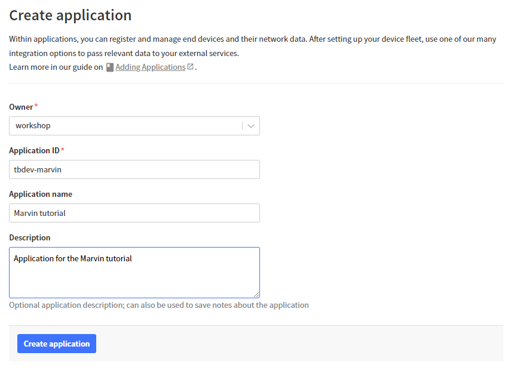

Next step is to add the device to the application. Hit the 'Register end device' button. 

For the 'Input Method' choose 'Select the end device in the LoRaWAN Device Repository'. We can use this because the hardware is very similar to the 'The Things Products Uno' (which is a Leonardo from Arduino point of view as well)

In the 'End device brand' select 'The Things Products', for 'Model' choose 'The Things Uno', 'Hardware Ver' is '1.0', 'Firmware Ver' is 'quickstart' and 'Profile' is 'EU_863_870'.

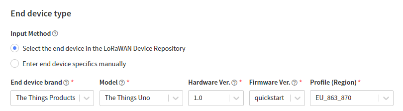

Now select 'Europe 863-870 MHz (SF9 for RX2 - recommended)' for 'Frequency plan'.

In the 'JoinEUI' enter the value from 'AppEUI' you wrote down earlier and 'Confirm'.

For the DevEUI use the EUI value, it should start with 0004A30.

Use the 'Generate' button to create a unique AppKey, copy and save the value for later use.

Feel free to enter an easier to use value in the 'End device ID' field. You need it to know what device you are referring to once you added more of them. Keep in mind it can not be changed later on.

Finish by clicking on the 'Register end device' button.

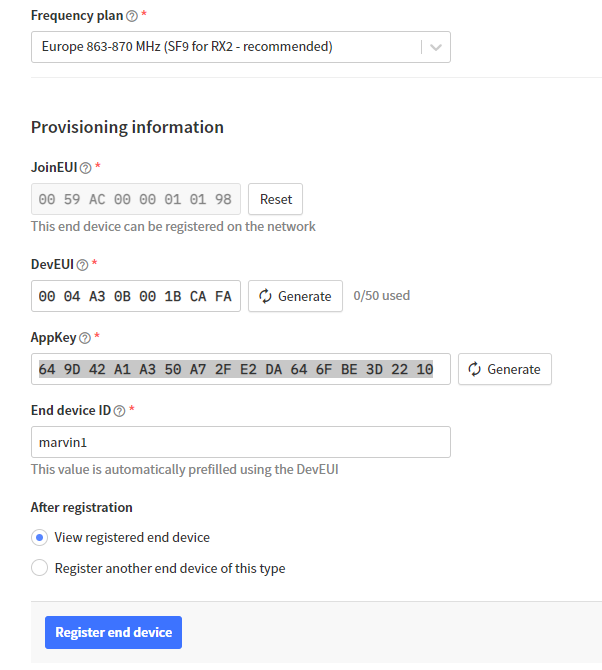

## Create sketch

The last step is to create a simple sketch that sends a fixed value to TTN. (Adding sensor code is left to the reader)

In the Arduino IDE go to 'File' - 'Examples', scroll to 'TheThingsNetwork' and choose 'SendOTAA'.

Modify the sketch by replacing the string 'REPLACE_ME' with 'TTN_FP_EU868' and add the following lines before 'setup':

```
int     reset_port = 5;
int     RN2483_power_port = 6; //Note that an earlier version of the Marvin doesn't support seperate power to RN2483
```

In 'setup', just after the line with the single ';' add:

```
  //Enable power to the RN2483
  pinMode(RN2483_power_port, OUTPUT);
  digitalWrite(RN2483_power_port, HIGH);
  debugSerial.println("RN2483 Powered up");
  delay(1000);
  
  //Disable reset pin
  pinMode(reset_port, OUTPUT);
  digitalWrite(reset_port, HIGH);
```

Add the correct AppEUI and AppKey in the lines below 'Set your AppEUI and AppKey'.

The resulting code should look like this (USE YOUR OWN AppEUI and AppKEY!!):

```
#include <TheThingsNetwork.h>

// Set your AppEUI and AppKey
const char *appEui = "0059AC0000010198";
const char *appKey = "!USE YOUR VALUE HERE!";

#define loraSerial Serial1
#define debugSerial Serial

// Replace REPLACE_ME with TTN_FP_EU868 or TTN_FP_US915
#define freqPlan TTN_FP_EU868
#define LED_BUILTIN 13

TheThingsNetwork ttn(loraSerial, debugSerial, freqPlan);

int     reset_port = 5;
int     RN2483_power_port = 6; //Note that an earlier version of the Marvin doesn't support seperate power to RN2483

void setup()
{
  loraSerial.begin(57600);
  debugSerial.begin(9600);

  // Wait a maximum of 10s for Serial Monitor
  while (!debugSerial && millis() < 10000)
    ;

  //Enable power to the RN2483
  pinMode(RN2483_power_port, OUTPUT);
  digitalWrite(RN2483_power_port, HIGH);
  debugSerial.println("RN2483 Powered up");
  delay(1000);
  
  //Disable reset pin
  pinMode(reset_port, OUTPUT);
  digitalWrite(reset_port, HIGH);

  debugSerial.println("-- STATUS");
  ttn.showStatus();

  debugSerial.println("-- JOIN");
  ttn.join(appEui, appKey);
}

void loop()
{
  debugSerial.println("-- LOOP");

  // Prepare payload of 1 byte to indicate LED status
  byte payload[1];
  payload[0] = (digitalRead(LED_BUILTIN) == HIGH) ? 1 : 0;

  // Send it off
  ttn.sendBytes(payload, sizeof(payload));

  delay(60000);
}
```

Compile and upload the code and watch the serial monitor to check what happens. It should display something like:

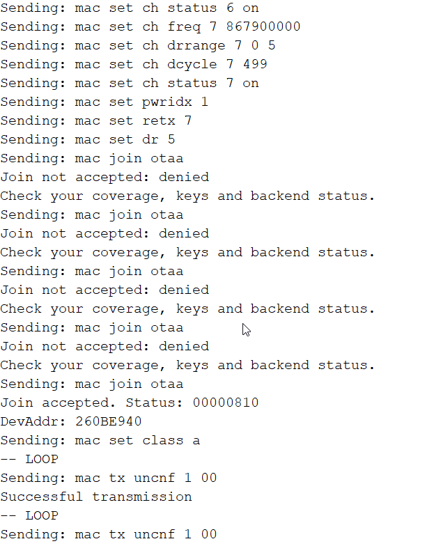

And at TTN the device overview should look like:

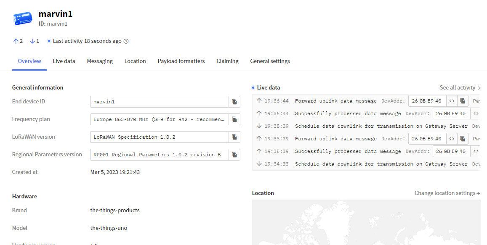


